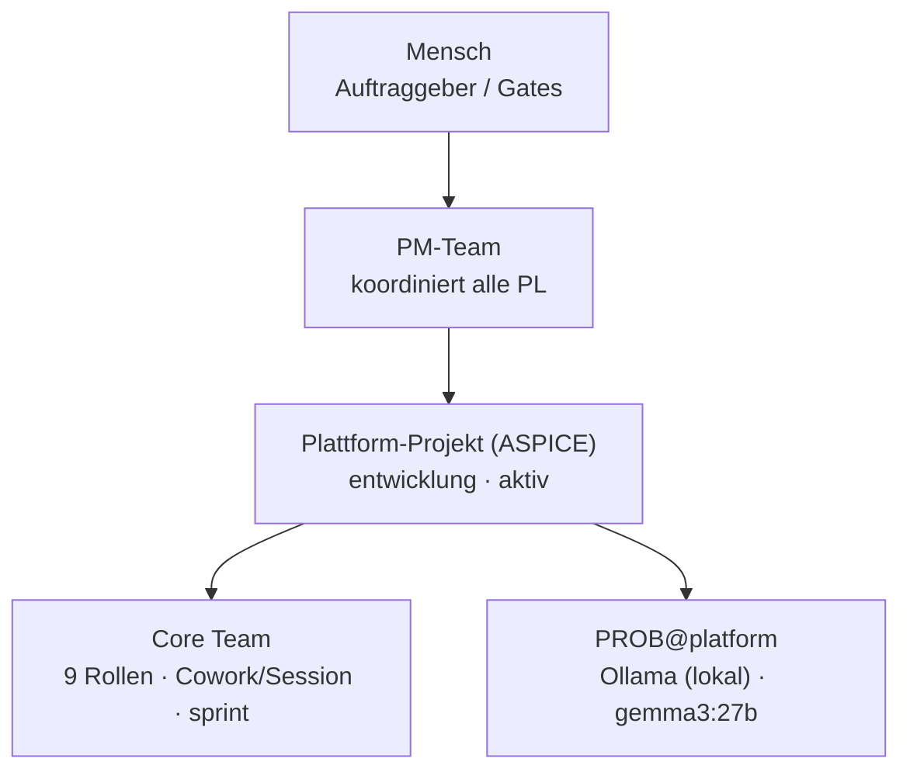

# Organigramm: Plattform-Projekt (ASPICE)

*Generiert aus den Registries (`process/teams/registry.yaml`, `process/roles/besetzungen.yaml`) durch `platform/scripts/organigramm.py` — **nicht von Hand pflegen**, Änderungen gehören in die Registry (Konzept `process/docs/03-rollenmodell-v2-orga-rework.md` Kap. 8).*

**Auftrag:** ASPICE-Team: entwickelt, pflegt und maintained alle Tools/Skripte und Mission Control - fuer Genesis, sich selbst, PM und alle Projekte (festes Team)

## Beteiligte

| Instanz | Rolle | Motor | Takt | Status | Quelle | Hinweis |
|---|---|---|---|---|---|---|
| ARCH@platform | Architekt | Cowork/Session | sprint | aktiv | Core Team (implizit) | — |
| CHG@platform | Change-Manager | Cowork/Session | sprint | aktiv | Core Team (implizit) | — |
| CM@platform | Konfigurationsmanager | Cowork/Session | sprint | aktiv | Core Team (implizit) | — |
| COACH@platform | Prozess-Coach | Cowork/Session | sprint | aktiv | Core Team (implizit) | — |
| DEV@platform | Entwickler | Cowork/Session | sprint | aktiv | Core Team (implizit) | — |
| PL@platform | Projektleiter | Cowork/Session | sprint | aktiv | Core Team (implizit) | — |
| PROB@platform | Problemmanager | Ollama (lokal) (gemma3:27b) | schnell | aktiv | explizit | Klassifikation/Trend lokal; Ursachenanalyse per Kette auf Claude |
| QM@platform | Qualitätsmanager | Cowork/Session | sprint | aktiv | Core Team (implizit) | — |
| RM@platform | Requirements-Manager | Cowork/Session | sprint | aktiv | Core Team (implizit) | — |
| TEST@platform | Verifikationsingenieur | Cowork/Session | sprint | aktiv | Core Team (implizit) | — |

Rollen-Bauplan: `process/roles/<rolle>.md` · projektspezifischer Teil: `roles/<rolle>.md` in diesem Repo · Historie: `docs/historie.md`
